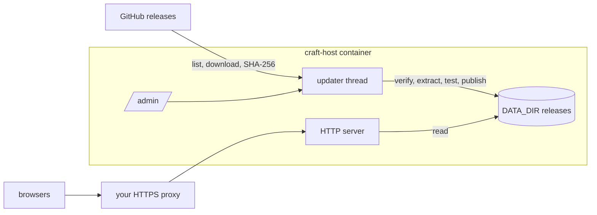

# Craft Apps Host

Self-hosts the official browser builds of the Craft apps (PhotoCraft, VectorCraft, FilmCraft,
LightCraft, PdfCraft, EffectCraft, DesignCraft) with Docker Compose. One small image serves the
apps, keeps them updated from their official GitHub releases in the background, and offers an
administration page for updates. App updates need no image rebuild and no restart.

The apps run in the visitor's browser. This host only serves their files: documents opened in
an app stay in the browser and are not uploaded, and server folders are not visible in the apps'
file dialogs. It provides no server-side document storage, sharing or synchronization.



- `/` lists the apps with their versions; `/photocraft/` redirects to the active immutable
  release (`/photocraft/0.5.0/`), so open tabs keep loading matching files after an update.
- Updates are downloaded, checksum-verified, extracted safely, tested over HTTP and published
  atomically in the background. Per app, a new release goes live **immediately** or once the
  app has had **no requests for a while** (`activation = "idle"`).
- `/admin` shows versions, pending releases and failures, and runs check, update, apply, pin,
  unpin, rollback and allow. Authentication: none, HTTP Basic, login form, OpenID Connect or a
  trusted reverse proxy's identity header. It is disabled by default.

No Docker socket, privileged mode, GPU or database is involved.

## Quick start

```sh
cp .env.example .env                  # set RUN_UID/RUN_GID, FILE_UMASK and the five directories
sudo install -d -o 1000 -g 10000 -m 2775 /srv/craft-apps/{config,data,state,cache,work}
cp config.example.toml /srv/craft-apps/config/config.toml
docker compose build
docker compose run --rm host doctor --offline
docker compose up -d
docker compose exec host craft-host status
```

Open `http://127.0.0.1:8080/` (or put it behind your HTTPS reverse proxy; see
[docs/install.md](docs/install.md)). The first installation takes a minute or two; the launcher
shows which apps are still being installed. To enable `/admin`, see
[docs/admin.md](docs/admin.md).

## Command line

`docker compose exec host craft-host <command>`:

| Command | Purpose |
| --- | --- |
| `status [--json]` | Installed, active, latest and pending versions, pins, blocks, failures |
| `doctor [--offline]` | Configuration, identity, permission, space, admin-access and connectivity checks |
| `check [APP]` / `update [APP]` | Look for, or install now, the newest eligible (or pinned) release |
| `apply APP` | Activate a release that is waiting for its app to be idle |
| `pin APP VERSION` / `unpin APP` | Hold an app on one release |
| `rollback APP [VERSION]` / `allow APP VERSION` | Go back to a retained release / permit a blocked one |
| `history [APP]` | Recent update history |
| `hash-password` | Hash a password (stdin) for the admin users file |

## Documentation

- [Installation and deployment](docs/install.md)
- [Administration interface and authentication](docs/admin.md)
- [Users, groups and permissions](docs/permissions.md)
- [Operations](docs/operations.md): updates, activation, pins, rollback, retention, backup, recovery
- [Applications](docs/apps.md): official artifacts, serving requirements, browser storage
- [Architecture and design decisions](docs/architecture.md)
- [Verification record](docs/verification.md)
- [Original project plan](docs/plan.md)

## Development

```sh
cd host
cargo test                                          # unit, lifecycle and HTTP/admin tests
cargo test --test compose -- --ignored --nocapture  # Docker Compose integration test
```
