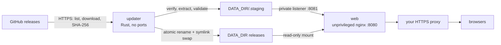

# Craft Apps Host

Self-hosts the official browser builds of the Craft apps (PhotoCraft, VectorCraft, FilmCraft,
LightCraft, PdfCraft, EffectCraft, DesignCraft) with Docker Compose, and keeps them updated from
their official GitHub releases without rebuilding images or restarting the web server.

The apps run in the visitor's browser. This host only serves their files: documents opened in
an app stay in the browser and are not uploaded, and server folders are not visible in the apps'
file dialogs. It provides no server-side document storage, sharing or synchronization.



- **web**: `nginxinc/nginx-unprivileged`, read-only root filesystem, reads `DATA_DIR` read-only.
  `/photocraft/` redirects to the active immutable release (`/photocraft/0.5.0/`), so open tabs
  keep loading matching files after an update.
- **updater**: a static Rust binary (`updater/`) on a distroless image. It discovers releases,
  verifies checksums, extracts archives safely, tests candidates through nginx, publishes them
  atomically, applies retention and publishes `status.json`. It is also the operator CLI.

Neither service needs the Docker socket, privileged mode, GPUs or a database.

## Quick start

```sh
cp .env.example .env                  # set RUN_UID/RUN_GID, FILE_UMASK and the five directories
sudo install -d -o 1000 -g 10000 -m 2775 /srv/craft-apps/{config,data,state,cache,work}
cp config.example.toml /srv/craft-apps/config/config.toml
docker compose build updater
docker compose run --rm --no-deps updater doctor --offline
docker compose up -d
docker compose exec updater craft-updater status
```

Open `http://127.0.0.1:8080/` (or put it behind your HTTPS reverse proxy; see
[docs/install.md](docs/install.md)). The first installation takes a minute or two; the launcher
shows which apps are still being installed.

## Operator commands

Run inside the updater container: `docker compose exec updater craft-updater <command>`.

| Command | Purpose |
| --- | --- |
| `status [--json]` | Installed, active and latest versions, pins, blocks, last check, failures |
| `doctor [--offline]` | Configuration, identity, permission, space, filesystem and connectivity checks |
| `check [APP]` | Look for newer releases without installing |
| `update [APP]` | Install the newest eligible (or pinned) release now |
| `pin APP VERSION` / `unpin APP` | Hold an app on one release |
| `rollback APP [VERSION]` | Activate a retained older release; blocks the current one |
| `allow APP VERSION` | Allow a release blocked by a rollback |
| `history [APP]` | Recent update history |

## Documentation

- [Installation and deployment](docs/install.md): directories, `.env`, HTTPS proxy, upgrades
- [Users, groups and permissions](docs/permissions.md)
- [Operations](docs/operations.md): updates, status, pins, rollback, retention, backup, recovery, failures
- [Applications](docs/apps.md): official artifacts, serving requirements, browser storage
- [Architecture and design decisions](docs/architecture.md)
- [Verification record](docs/verification.md)
- [Original project plan](docs/plan.md)

## Development

```sh
cd updater
cargo test                                         # unit + lifecycle tests (fake GitHub)
cargo test --test compose -- --ignored --nocapture # Docker Compose integration test
```
